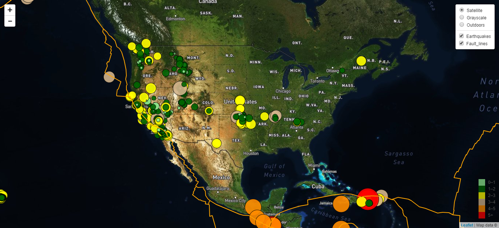

#  Visualizing Data with Leaflet

This project is an example of how to use Leaflet.js to visualize geoJSON data. The javascript uses Leaflet layer control using basemaps and overlay maps. 
This project plots all of the earthquakes and faultlines based on their longitude and latitude to find the relationship between tectonic plates and seismic activity. Below is a screenshot of the visualization. 

